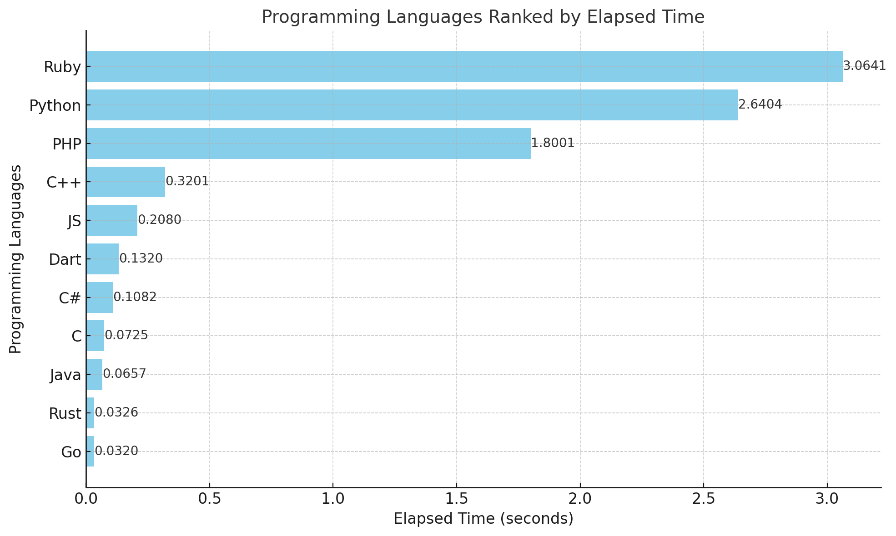
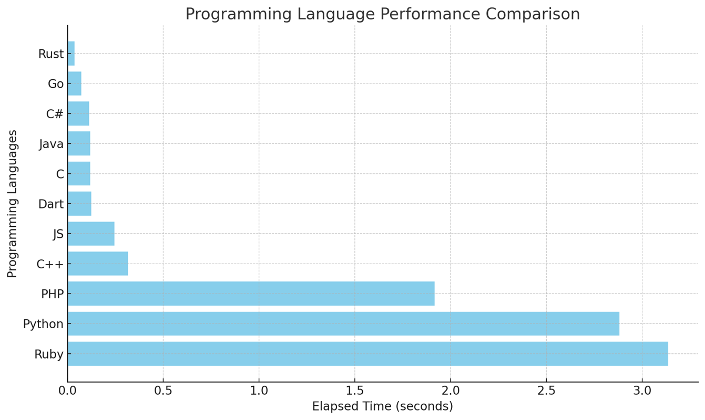

# LangBench: Cross-Language Performance Benchmarking

Welcome to LangBench! This project aims to benchmark the performance of various programming languages by running a Fibonacci calculation, matrix multiplication, sorting Algorithms (quicksort, mergesort, heapsort, and insertion sort) and search algorithms (Liner and Binary, to add jump and exponential search). Our goal is to provide a comprehensive comparison of execution times across different languages and encourage contributions from the developer community.

## Why LangBench?

- **Comprehensive**: Compare multiple languages in one place.
- **Open Source**: Contribute and improve the benchmarks.
- **Up-to-Date**: Regularly updated with the latest language versions.
- **Community-Driven**: Collaborate with developers worldwide.

## Getting Started

### How to Run the Benchmark

1. Clone the repository:
    ```sh
    git clone https://github.com/Skipper-116/langbench.git
    cd langbench
    ```

2. Ensure you have the required versions of each language installed on your system.

3. Run the `test.sh` script from the terminal:
    ```sh
    sh test.sh
    ```

### Language Versions

The following language versions are used in this project:

- **C++**: Apple clang version 16.0.0 (clang-1600.0.26.4)
- **C**: Apple clang version 16.0.0 (clang-1600.0.26.4)
- **C#**: .NET 9.0.100
- **Java**: OpenJDK 17
- **Ruby**: ruby 3.2.0 (2022-12-25 revision a528908271) [arm64-darwin23]
- **Python**: Python 3.12.7
- **JavaScript**: Node.js v20.15.1
- **PHP**: PHP 8.3.14
- **Go**: go1.23.3 darwin/arm64
- **Rust**: rustc 1.83.0 (90b35a623 2024-11-26)
- **Dart**: Dart SDK version: 3.4.3 (stable) (Tue Jun 4 19:51:39 2024 +0000)

## Project Structure

- `./cPlusPlus/main.cpp`: Contains the C++ implementation.
- `./cSharp/Program.cs`: Contains the C# implementation.
- `./javaCode/Main.java`: Contains the Java implementation.
- `./rubyCode/sample.rb`: Contains the Ruby implementation.
- `./cCode/program.c`: Contains the C implementation.
- `./pyCode/main.py`: Contains the Python implementation.
- `./jsCode/index.js`: Contains the JavaScript implementation.
- `./phpCode/index.php`: Contains the PHP implementation.
- `./goCode/main.go`: Contains the Go implementation.
- `./rustCode/src/main.rs`: Contains the Rust implementation.
- `./dartCode/program.dart`: Contains the Dart implementation.
- `test.sh`: Script to run the benchmarks for each language.

## Current Output

After running the `test.sh` script, you will see output similar to the following:

```sh
Elapsed time C#: 0.1122968 seconds
Elapsed time Go: 0.071175 seconds
Elapsed time JS: 0.244 seconds
Elapsed time Rust: 0.03589858 seconds
Elapsed time Java: 0.1172085 seconds
Elapsed time C++: 0.314265 seconds
Elapsed time Dart: 0.124 seconds
Elapsed time C: 0.117350 seconds
Elapsed time PHP: 1.9165921211243 seconds
Elapsed time Python: 2.880129098892212 seconds
Elapsed time Ruby: 3.134608 seconds
```

Visual representation of the output before sorting algorithms:


Visual representation of the output after sorting algorithms:


Visual representation of the output after search algorithms:


## Contributing
We welcome contributions from the community to improve LangBench. Here are some ways you can contribute:

1. **Report Bugs**: If you find any bugs, please report them by creating an issue on our GitHub repository.
2. **Suggest Features**: Have an idea for a new feature? Open an issue to discuss it with the community.
3. **Submit Pull Requests**: If you have a fix or a new feature, feel free to submit a pull request. Make sure to follow the contribution guidelines.
4. **Improve Documentation**: Help us improve our documentation by suggesting changes or adding new content.
5. **Benchmark New Languages**: Add benchmarks for new programming languages and submit a pull request.

## Requirements
Make sure you have the following installed on your system:

* C++ compiler (Apple clang version 16.0.0 or compatible)
* C compiler (Apple clang version 16.0.0 or compatible)
* .NET 9.0.100
* OpenJDK 21.0.3
* ruby 3.2.0 (2022-12-25 revision a528908271) [arm64-darwin23]
* Python 3.12.7 juiced with NumPy
* Node.js v20.15.1
* PHP 8.3.14
* Go go1.23.3 darwin/arm64
* Rust rustc 1.83.0 (90b35a623 2024-11-26) && cargo 1.83.0
* Dart Dart SDK version: 3.4.3 (stable) (Tue Jun 4 19:51:39 2024 +0000)

We have provided a script to install the required versions of each language but it is important to note that this has not yet been tested, you might as well contribute to it. Run the following command:

```sh
sh setup.sh
```