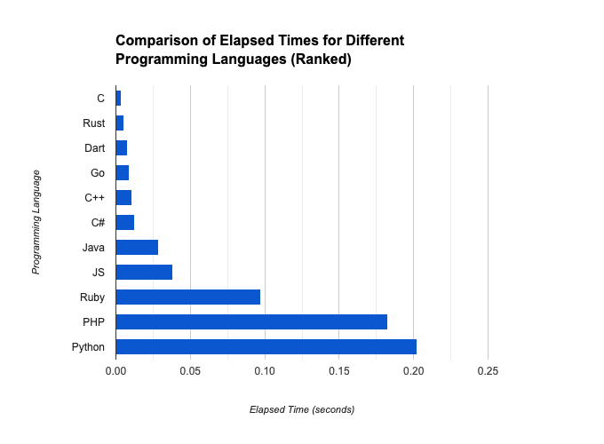

# LangBench: Cross-Language Performance Benchmarking

Welcome to LangBench! This project aims to benchmark the performance of various programming languages by running a Fibonacci calculation and matrix multiplication. Our goal is to provide a comprehensive comparison of execution times across different languages and encourage contributions from the developer community.

## Why LangBench?

- **Comprehensive**: Compare multiple languages in one place.
- **Open Source**: Contribute and improve the benchmarks.
- **Up-to-Date**: Regularly updated with the latest language versions.
- **Community-Driven**: Collaborate with developers worldwide.

## Getting Started

### How to Run the Benchmark

1. Clone the repository:
    ```sh
    git clone https://github.com/Skipper-116/langbench.git
    cd langbench
    ```

2. Ensure you have the required versions of each language installed on your system.

3. Run the `test.sh` script from the terminal:
    ```sh
    sh test.sh
    ```

### Language Versions

The following language versions are used in this project:

- **C++**: Apple clang version 16.0.0 (clang-1600.0.26.4)
- **C**: Apple clang version 16.0.0 (clang-1600.0.26.4)
- **C#**: .NET 9.0.100
- **Java**: OpenJDK 17
- **Ruby**: ruby 3.2.0 (2022-12-25 revision a528908271) [arm64-darwin23]
- **Python**: Python 3.12.7
- **JavaScript**: Node.js v20.15.1
- **PHP**: PHP 8.3.14
- **Go**: go1.23.3 darwin/arm64
- **Rust**: rustc 1.83.0 (90b35a623 2024-11-26)
- **Dart**: Dart SDK version: 3.4.3 (stable) (Tue Jun 4 19:51:39 2024 +0000)

## Project Structure

- `./cPlusPlus/main.cpp`: Contains the C++ implementation of the Fibonacci calculation and matrix multiplication.
- `./cSharp/Program.cs`: Contains the C# implementation of the Fibonacci calculation and matrix multiplication.
- `./javaCode/Main.java`: Contains the Java implementation of the Fibonacci calculation and matrix multiplication.
- `./rubyCode/sample.rb`: Contains the Ruby implementation of the Fibonacci calculation and matrix multiplication.
- `./cCode/program.c`: Contains the C implementation of the Fibonacci calculation and matrix multiplication.
- `./pyCode/main.py`: Contains the Python implementation of the Fibonacci calculation and matrix multiplication.
- `./jsCode/index.js`: Contains the JavaScript implementation of the Fibonacci calculation and matrix multiplication.
- `./phpCode/index.php`: Contains the PHP implementation of the Fibonacci calculation and matrix multiplication.
- `./goCode/main.go`: Contains the Go implementation of the Fibonacci calculation and matrix multiplication.
- `./rustCode/src/main.rs`: Contains the Rust implementation of the Fibonacci calculation and matrix multiplication.
- `./dartCode/program.dart`: Contains the Dart implementation of the Fibonacci calculation and matrix multiplication.
- `test.sh`: Script to run the benchmarks for each language.

## Current Output

After running the `test.sh` script, you will see output similar to the following:

```sh
Elapsed time C#: 0.012443 seconds
Elapsed time Go: 0.009214 seconds
Elapsed time Python: 0.20249485969543457 seconds
Elapsed time Java: 0.028840167 seconds
Elapsed time PHP: 0.18245697021484 seconds
Elapsed time JS: 0.038 seconds
Elapsed time Rust: 0.00520133 seconds
Elapsed time Ruby: 0.097235 seconds
Elapsed time C: 0.003723 seconds
Elapsed time C++: 0.0107881 seconds
Elapsed time Dart: 0.008 seconds
```

Visual representation of the output:


## Requirements
Make sure you have the following installed on your system:

* C++ compiler (Apple clang version 16.0.0 or compatible)
* C compiler (Apple clang version 16.0.0 or compatible)
* .NET 9.0.100
* OpenJDK 21.0.3
* ruby 3.2.0 (2022-12-25 revision a528908271) [arm64-darwin23]
* Python 3.12.7
* Node.js v20.15.1
* PHP 8.3.14
* Go go1.23.3 darwin/arm64
* Rust rustc 1.83.0 (90b35a623 2024-11-26) && cargo 1.83.0
* Dart Dart SDK version: 3.4.3 (stable) (Tue Jun 4 19:51:39 2024 +0000)